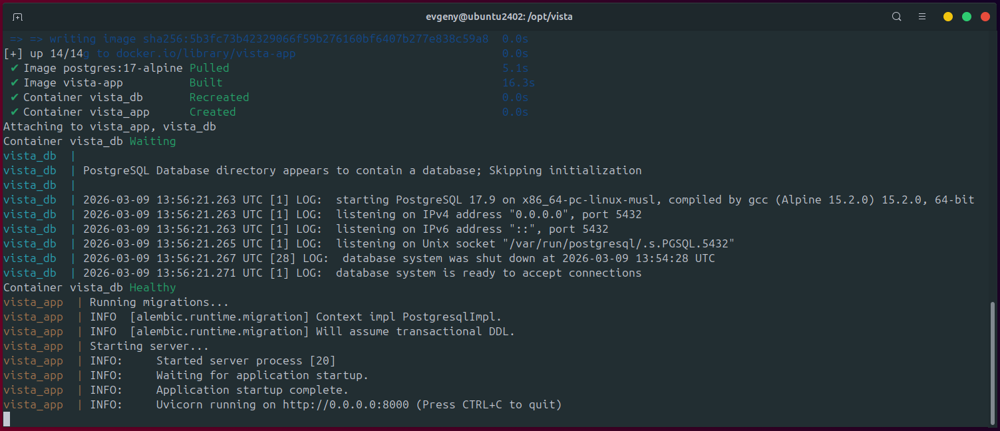
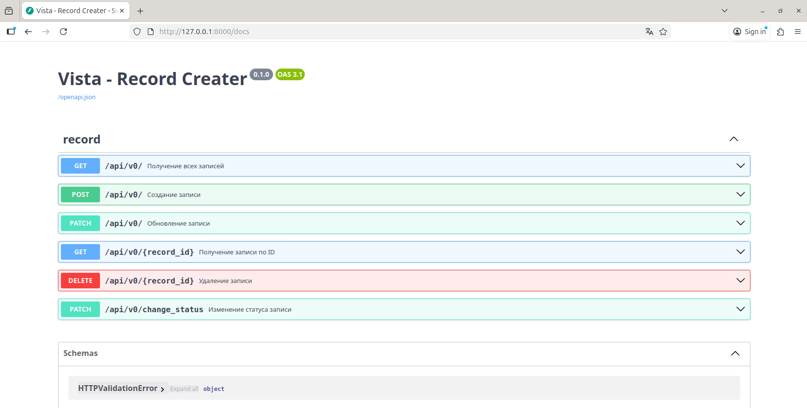

# Vista - Record Creator

REST API на FastAPI для управления записями.

## Запуск через Docker

### 1. Клонировать репозиторий

```bash
git clone https://github.com/heavenyoung1/vista
cd vista
```

### 2. Скопировать и заполнить `.env`

```env
cp .env.example .env
```

### 2. Запустить

```bash
docker compose up --build
```

При старте автоматически:
- Поднимается PostgreSQL
- Применяются миграции (`alembic upgrade head`)
- Запускается API сервер

API доступен на: `http://localhost:8000`
Документация: `http://localhost:8000/docs`

### Остановить

```bash
docker compose down
```

## Примеры корректной работы

### Сборка приложения



### Работающее приложение

